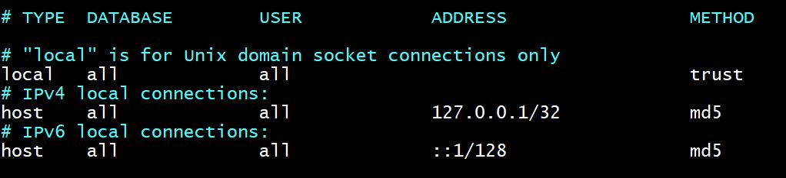

### Steps:
## 1. Install Java 17
```
sudo yum -y update
```
```
sudo yum -y install wget vim curl unzip 
```
```
wget https://download.oracle.com/java/17/latest/jdk-17_linux-x64_bin.rpm
```
```
sudo yum -y install ./jdk-17_linux-x64_bin.rpm
```
```
java -version
```
## 2. Configure SELinux as Permissive

```
sudo setenforce 0
```
```
sudo sed -i 's/^SELINUX=enforcing$/SELINUX=permissive/' /etc/selinux/config
```
## 3. Tweak max_map_count and fs.file-max

```
sudo tee -a /etc/sysctl.conf<<EOF
vm.max_map_count=262144
fs.file-max=65536
EOF
```
```
sudo sysctl --system
```
## 4. Create a user for sonar

```
sudo useradd sonar
```

## 5. Add sonar user to sudoers file

```
echo "sonar   ALL=(ALL)       NOPASSWD: ALL" | sudo tee -a /etc/sudoers
```
## 6. Install and configure PostgreSQL

```
sudo yum install -y https://download.postgresql.org/pub/repos/yum/reporpms/EL-7-x86_64/pgdg-redhat-repo-latest.noarch.rpm
```
```
sudo yum -y install postgresql14-server postgresql14
```
```
sudo /usr/pgsql-14/bin/postgresql-14-setup initdb
```
```
sudo systemctl enable --now postgresql-14
```
## 7. Change the pg_hba.conf file settings

```
sed -i 's/local\s\+all\s\+all\s\+peer/local   all             all                                     trust/'  /var/lib/pgsql/14/data/pg_hba.conf
```
```
sed -i 's/host    all             all             127.0.0.1\/32            scram-sha-256/host    all             all             127.0.0.1\/32            md5/' /var/lib/pgsql/14/data/pg_hba.conf
```
```
sed -i 's/host    all             all             ::1\/128                 scram-sha-256/host    all             all             ::1\/128                 md5/' /var/lib/pgsql/14/data/pg_hba.conf
```
```
echo "host    all             all             0.0.0.0/0            md5" | sudo tee -a /var/lib/pgsql/14/data/pg_hba.conf
```


## 8. Enable remote Access to PostgreSQL

Edit the file /var/lib/pgsql/14/data/postgresql.conf and set Listen address to your server IP address or "*" for all interfaces.

```
echo "listen_addresses = '*'" | sudo tee -a /var/lib/pgsql/14/data/postgresql.conf
```

## 9. Restart PostgreSQL service

```
sudo systemctl restart postgresql-14
```

## 10. Set PostgreSQL admin user

```
sudo su - postgres
```
```
psql 
```
```
alter user postgres with password 'Sonar@123';
```
```
exit
```

## 11. Create a SonarQube user and database

```
createdb sonarqube
```
```
psql
```
```
CREATE USER sonarqube WITH PASSWORD 'Sonar@123';
```
```
GRANT ALL PRIVILEGES ON DATABASE sonarqube to sonarqube;
```
```
\q
```

## 12. Download and install SonarQube

```
wget https://binaries.sonarsource.com/Distribution/sonarqube/sonarqube-9.9.1.69595.zip
```
```
unzip sonarqube-*.zip
```

```
sudo mv sonarqube-*/  /opt/sonarqube
```
```
rm  -rf sonarqube*
```
```
ulimit -l unlimited
```
```
ulimit -n 65536
```
```
echo "transport.tcp.compress: true" | sudo tee -a /opt/sonarqube/elasticsearch/config/elasticsearch.yml
```
```
echo "transport.tcp.port: 9300" | sudo tee -a /opt/sonarqube/elasticsearch/config/elasticsearch.yml
```

## 13. Configure SonarQube

```
sudo tee -a /opt/sonarqube/conf/sonar.properties<<EOF
##Database details
sonar.jdbc.username=sonarqube
sonar.jdbc.password=Sonar@123
sonar.jdbc.url=jdbc:postgresql://localhost/sonarqube?

##How you will access SonarQube Web UI
sonar.web.host=0.0.0.0
sonar.web.port=9000

##Java options
sonar.web.javaOpts=-server -Xms512m -Xmx512m -XX:+HeapDumpOnOutOfMemoryError
sonar.search.javaOpts=-Xmx512m -Xms512m -XX:MaxDirectMemorySize=256m -XX:+HeapDumpOnOutOfMemoryError

##Also add the following Elasticsearch storage paths
sonar.path.data=/var/sonarqube/data
sonar.path.temp=/var/sonarqube/temp
EOF
```
```
sudo chown -R sonar:sonar /opt/sonarqube
```
```
sudo mkdir -p /var/sonarqube
```
```
sudo chown -R sonar:sonar /var/sonarqube
```

## 14. Add SonarQube SystemD service file

```
sudo tee -a /etc/systemd/system/sonarqube.service<<EOF
[Unit]
Description=SonarQube service
After=syslog.target network.target

[Service]
Type=forking
ExecStart=/opt/sonarqube/bin/linux-x86-64/sonar.sh start
ExecStop=/opt/sonarqube/bin/linux-x86-64/sonar.sh stop
LimitNOFILE=65536
LimitNPROC=4096
User=sonar
Group=sonar
Restart=on-failure

[Install]
WantedBy=multi-user.target
EOF
```

```
sudo systemctl daemon-reload
```
```
sudo systemctl start sonarqube.service
```
```
sudo systemctl status sonarqube.service
```
```
sudo systemctl enable sonarqube.service
```

## 15. Alter Firewall rules to allow SonarQube Access

```
sudo firewall-cmd --permanent --add-port=9000/tcp && sudo firewall-cmd --reload
```
